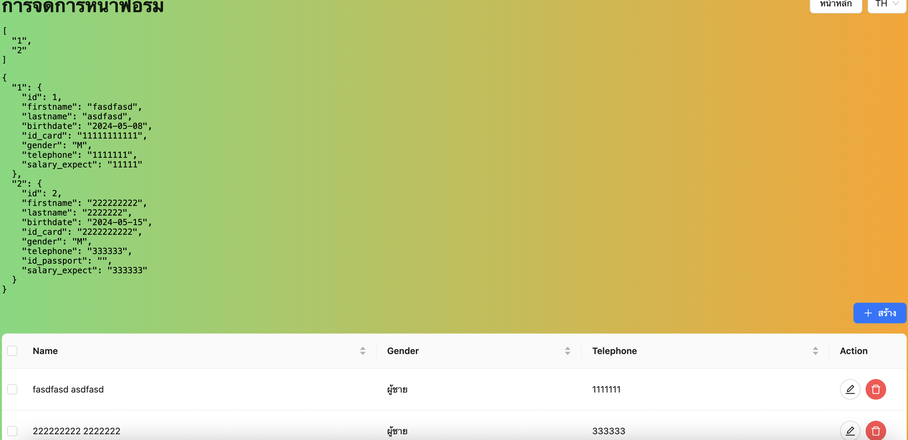

# Swift Dynamics Test with Next.js

### Checklist

- [ ] Assignment 1 (Incomplete)
- [x] Assignment 2

### How to Install
```sh
yarn
```

## How to Run Localhost
```sh
yarn dev
```

# Assignment

1. Frontend React (ตาม Clip ตัวอย่าง)
   - [x] ใช้ Typescript 
   - [x] สร้างตัวเปลี่ยนภาษา ด้วย i18next 
   - [x] จัด Layout ของปุ่มด้วย Antd Design 
   - [ ] สร้างรูปทรงต่าง ๆ ของปุ่มด้วย CSS (ถ้าใช้ SCSS จะพิจารณาเป็นพิเศษ) 
   - แต่ละปุ่มสามารถจัดการหน้าเว็บได้ดังนี้ 
     - [ ] Move Shape ให้เลื่อนรูปทรงด้านล่างโดนหมุนไปทางซ้าย 
     - [ ] Move Position ให้สลับ Grid Layout ขึ้นลง
     - [ ] เมื่อคลิกที่ปุ่มรูปทรงต่าง ๆ ด้านล่างให้ทำการสุ่มตำแหน่งใหม่ 
     - [x] สีที่ใช้ `#ffa200`, `#6eda78` 

2. สร้าง SPA (single page application) ด้วย Ant Design เก็บข้อมูลบุคคล (ตามไฟล์ภาพ) โดย
   - [ ] จัดการข้อมูลทั้ง Create, Edit และ Delete ลงบน Local Storage (เมื่อ Refesh หน้าเว็บไซต์ข้อมูลต้องไม่หายไป)
   - [x] ใช้ Redux-toolkit จัดการข้อมูลของฟอร์ม แทน useState
   - [x] ตารางต้องมี Pagination, sorting และสามารถเลือกลบตามแต่ละรายการได้

### Result

